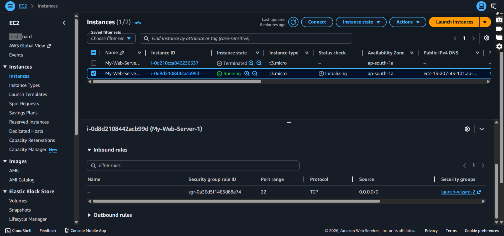
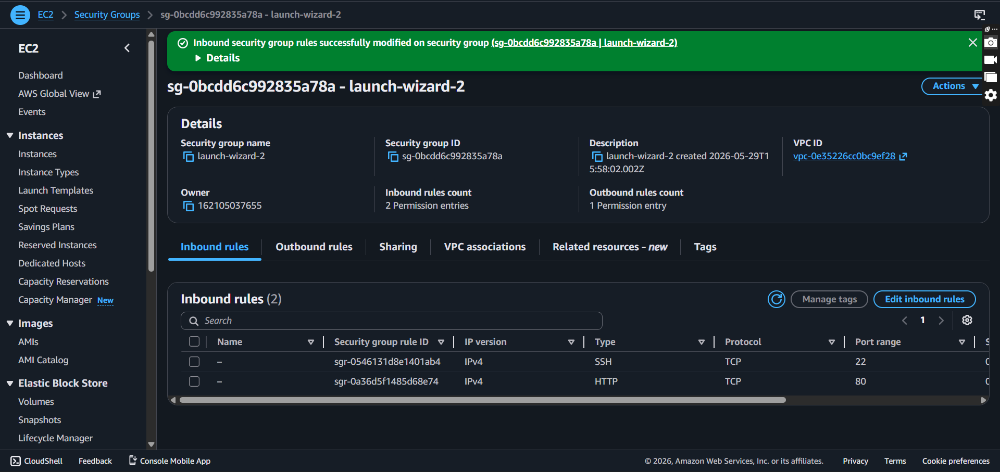
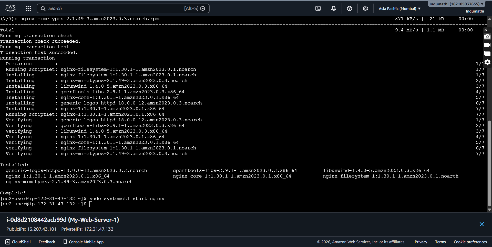
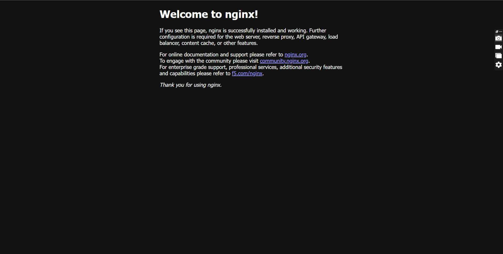

# AWS EC2 Nginx Webserver

## Overview

Successfully launched an AWS EC2 instance and deployed Nginx web server.

## Screenshots

### EC2 Dashboard

### Security Group

### Nginx Installation

### Live Website

## Skills Learned

- EC2
- Security Groups
- Nginx
- Linux
